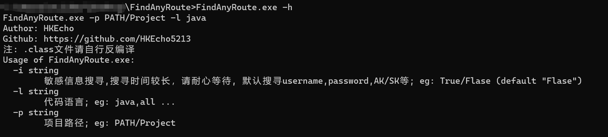
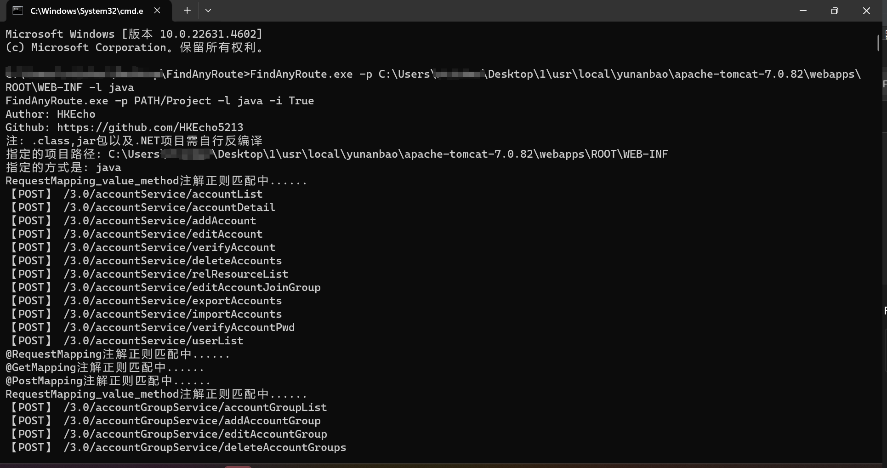
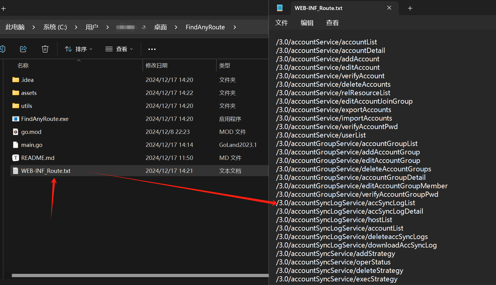
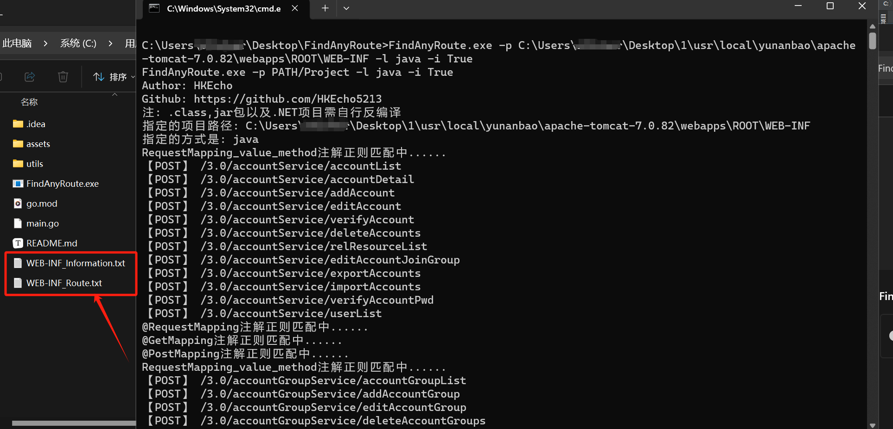
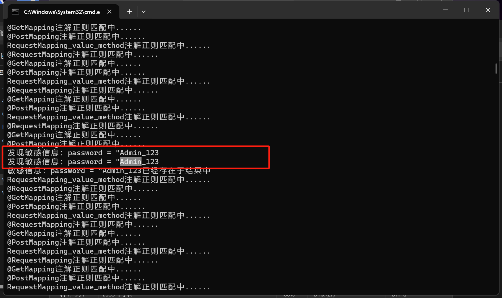
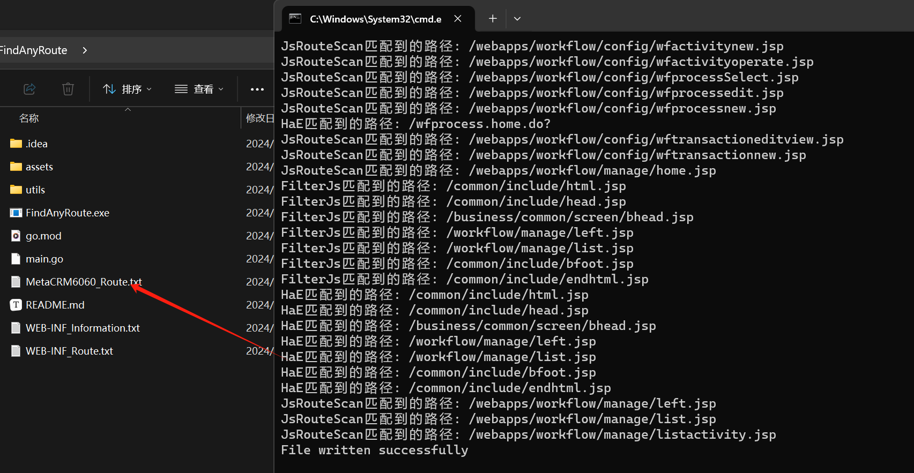
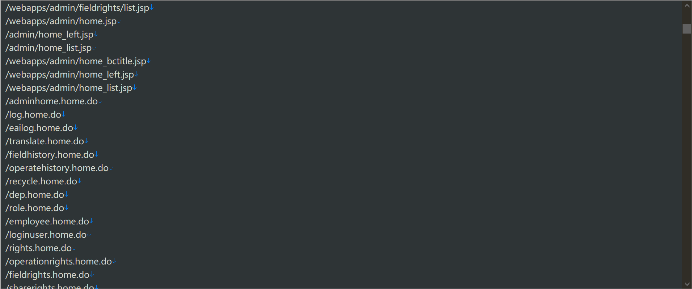

# FindAnyRoute路由提取工具

## 1、简介

​		目前支持java以及任意项目的路由提取，敏感信息收集。工具走了多重正则匹配，确保路由能完全提取，由于是通过正则提取的方式去提取路由，所以导致了存在结果不统一的问题，已经对结果进行了多重过滤处理，但是可能还得手动处理一下数据，但已经节省了很大的工作量。

**注意事项**

1、.class，jar包以及.NET项目需自行反编译；

2、若项目过大，则敏感信息收集时间较久，可通过传参自行决定是否需要进行。



## 2、工具使用

```
FindAnyRoute>FindAnyRoute.exe -h
FindAnyRoute.exe -p PATH/Project -l java -i True
Author: HKEcho
Github: https://github.com/HKEcho5213
注: .class,jar包以及.NET项目需自行反编译
Usage of FindAnyRoute.exe:
  -i string
        敏感信息搜寻,搜寻时间较长，请耐心等待, 默认搜寻username,password,AK/SK等; eg: True/Flase (default "Flase")
  -l string
        代码语言; eg: java,all ...
  -p string
        项目路径; eg: PATH/Project
```

### 2.1、针对java_springboot类项目

1、不进行信息收集：

```
FindAnyRoute.exe -p PATH/Project -l java
```



运行完成后会在当前目录下生成对应的项目文件结果，如下：



2、进行信息收集：

```
FindAnyRoute.exe -p PATH/Project -l java -i True
```

运行完成后会在当前目录下生成对应的项目路由和敏感信息结果





### 2.2、针对所有项目

​	不需要管什么项目语言，只要指定项目文件，即可提取路由与敏感信息 ，这个默认会先调用针对java_springboot类项目进行匹配，然后再通过自身的代码模块进行匹配，前后共经过14层匹配，并且对结果进行了多重过滤处理，在不影响最终结果的情况下，尽可能缩小了冗余数据。

```
FindAnyRoute.exe -p PATH/Project -l all
注：可跟"-i True"参数进行敏感信息匹配
```



